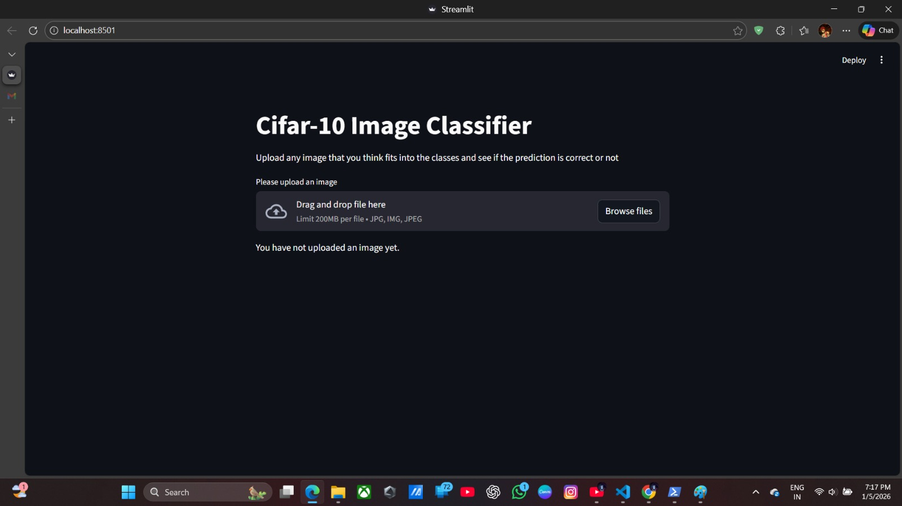

**🖼️ CIFAR-10 Image Classifier (Streamlit)**

A Streamlit-based web application that uses a trained CNN model on the CIFAR-10 dataset to classify uploaded images into one of 10 categories. Upload an image and visualize prediction probabilities in real time.

**🚀 Features**

📤 Upload images (.jpg, .png recommended) 
🧠 CNN model trained on CIFAR-10 dataset 
📊 Horizontal bar chart showing class probabilities 
⚡ Fast, interactive Streamlit UI 
🔍 Displays confidence for all 10 classes 

**🧠 CIFAR-10 Classes**

The model predicts one of the following classes:
airplane 
automobile 
bird 
cat 
deer 
dog 
frog 
horse 
ship 
truck 

**🛠️ Tech Stack**

Python 3.13.7 
Streamlit – Web interface 
TensorFlow / Keras – Model loading & inference 
NumPy – Image preprocessing 
Matplotlib – Probability visualization 
Pillow (PIL) – Image handling 

**⚙️ Installation & Setup**

1️⃣ Clone the Repository 
git clone https://github.com/your-username/cifar10-streamlit-classifier.git 
cd cifar10-streamlit-classifier 
2️⃣ Create a Virtual Environment (Recommended) 
python -m venv venv 
source venv/bin/activate      # Linux / macOS 
venv\Scripts\activate         # Windows 
3️⃣ Install Dependencies 
pip install -r requirements.txt 
▶️ Run the Application 
streamlit run app.py 

**🧪 How It Works**

User uploads an image using Streamlit 
Image is resized to 32×32 pixels 
Pixel values are normalized to [0, 1] 
Image reshaped to (1, 32, 32, 3) 
Pre-trained CIFAR-10 CNN predicts probabilities 
Results are displayed as a horizontal bar chart 

Author: Gaurav
KnownGaurav
